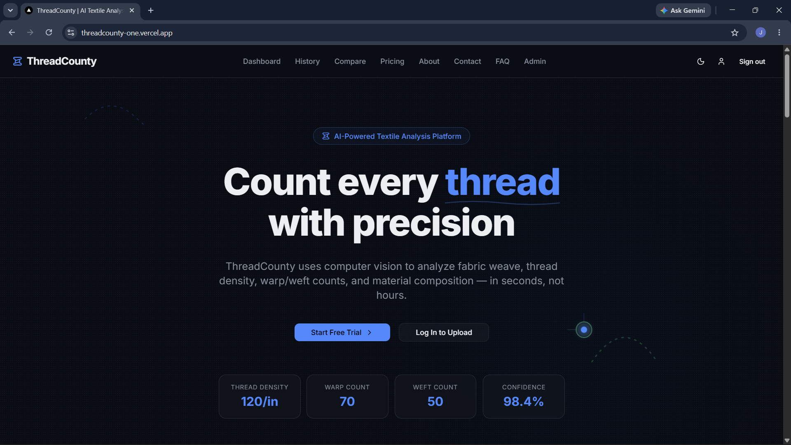

<div align="center">
  
  <h1>ThreadCounty</h1>
  <p><strong>Transforming a photo into an industrial procurement spec sheet in seconds.</strong></p>

  [](https://nextjs.org/)
  [](https://supabase.com)
  [](https://tailwindcss.com/)
  [](https://threadcounty-one.vercel.app/)
</div>

<hr />

## 🚀 The Problem
The textile industry still relies on archaic, physical methods for quality control and procurement. Identifying fabric type, thread density, GSM (Grams per Square Meter), and weave structure takes days of sending samples to labs. This delays supply chains, increases procurement friction, and restricts smaller players from competing globally.

## 💡 Our Solution
**ThreadCounty** bridges the gap between raw textile images and industrial procurement. By leveraging AI Vision models and deterministic textile engineering algorithms, we instantly analyze a single macro-photo of a fabric and generate a comprehensive, exportable procurement spec sheet.

---

## ✨ Key Features

- **📸 Instant AI Fabric Analysis:** Upload a close-up image of any fabric. The system identifies the material type (Cotton, Silk, Polyester, etc.) and analyzes the weave structure.
- **🧮 Textile Engineering Engine:** Uses the AI's thread count (Warp/Weft) and density data to calculate industrial metrics like Estimated GSM and Procurement Quality Grade.
- **📄 Procurement Spec Sheets:** Auto-generates a ready-to-share technical spec sheet including shrinkage risk, tear strength estimates, and AI-driven procurement suggestions.
- **📊 Interactive Dashboard:** Save all your analyses to the cloud. Compare different fabric samples side-by-side to make data-driven buying decisions.
- **🔐 Secure & Cloud-Native:** Fully authenticated user flows with image storage powered by Supabase.

---

## 🛠️ Tech Stack

- **Frontend:** Next.js 14 (App Router), React, Tailwind CSS, Framer Motion
- **Backend:** Next.js Server Actions
- **Database & Storage:** Supabase (PostgreSQL), Supabase Auth, Supabase Storage bucket
- **UI Components:** shadcn/ui
- **AI / Logic:** Vision-based heuristics & deterministic textile algorithms
- **Deployment:** Vercel

---

## 🚦 Getting Started

Follow these steps to run ThreadCounty locally.

### 1. Clone the repository
```bash
git clone https://github.com/Jiteshreddy123/Threadcounty.git
cd Threadcounty
```

### 2. Install dependencies
```bash
npm install
```

### 3. Setup Environment Variables
Create a `.env.local` file in the root directory and add your Supabase keys:
```env
NEXT_PUBLIC_SUPABASE_URL=your_supabase_url
NEXT_PUBLIC_SUPABASE_ANON_KEY=your_supabase_anon_key
```

### 4. Run the development server
```bash
npm run dev
```
Open [http://localhost:3000](http://localhost:3000) with your browser to see the application.

---

## 🎨 Visual Documentation
[](./threadcountyscreenshots.pdf)


